# Einleitung Motivation Vorstellung

* Haus von 1958 in Werl
    * Hohlblocksteine
    * Größtenteils 2-fach Verglasung
    * Kein Wärmedämmverbundsystem (WDVS)
    * Dach neu gedämmt mit 16cm PUR
    * Ost/Süd/West PV Anlage
    * 6,8 kWh DIY Batterie (LiFePo4)
* 2 Erwachsene, 1 Kind

# Problemstellung / Zielsetzung / Anforderungen

* Gasheizung (17–22 kW), technisch am Ende der Lebensdauer (EOL), inkl. Warmwasser
    * Verbrauch 19.000 - 20.000 kWh Gas pro Jahr, davon ca. 8 kWh / Tag für Warmwasser
    * Nur Heizkörper (Guss sowie Typ 22 und Typ 33), keine Flächenheizung
* Gas ist teuer, klimaschädlich und nur begrenzt vorhanden
* 2.920 kWh Gas für Warmwasser alleine sind indiskutabel
* Selbst erzeugter Strom soll mehr genutzt werden
* Wärmepumpen sind geil: thermische Leistung immer über elektrischer Leistung

# Dimensionierung Warmwasser

* Warmwasser getrennt vs integriert
* Warmwasser 200L reicht für 30min duschen oder eine Badewanne
* Ergebnis: Panasonic PAW-DHW200F
* 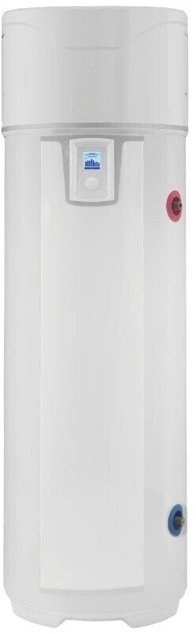

# Dimensionierung Heizung

## Kenndaten

* Warmwasser macht ca 10% aus
* DIN Heizlast stark theoretisch vs Wärmemengenzähler (WMZ) vs Auslegung nach Verbrauch in 24h
* Kältester Tag: 17.12.2022. Gasverbrauch: **122 kWh/24h**
* Wärmeleistung (abzgl. Ineffizienz Gasheizung und abzgl Warmwasser): **~100 kWh/24h**
* 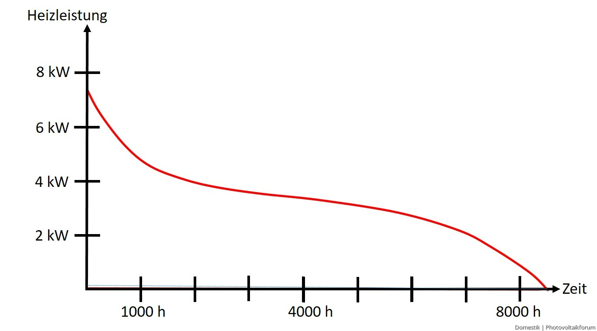
* 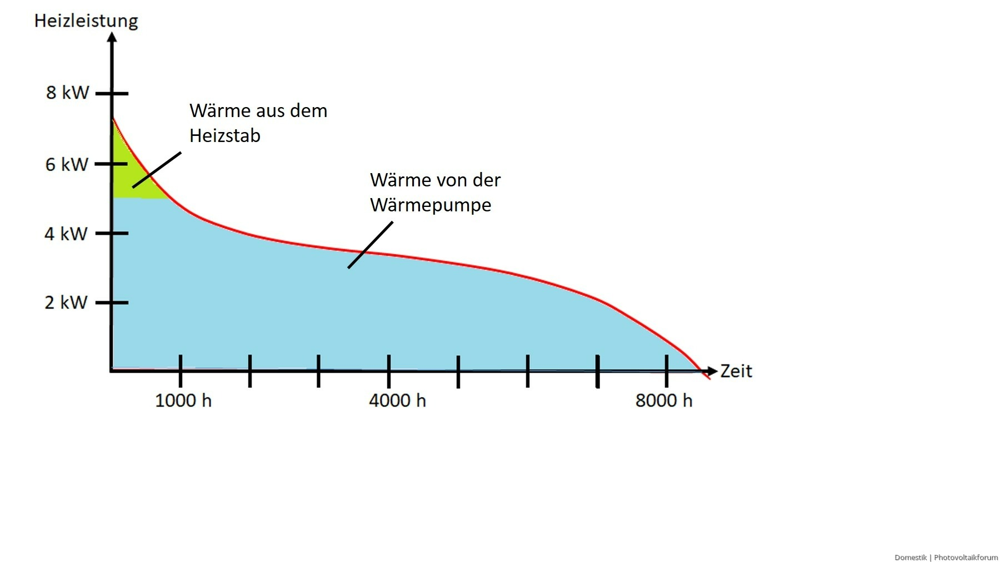

### Laut Datenblatt

| Modell              | A -7°C, W35°C (kW) | A -7°C, W 55°C (kW) | A +7°C, W 35°C (kW) | A +7°C, W 55°C (kW) |
|---------------------|--------------------|---------------------|---------------------|---------------------|
| WH-MDC05J3E5 (5 kW) | 5,00               | 	5,00               | 	5,00               | 	5,00               |
| WH-MDC07J3E5 (7 kW) | 6,80               | 	6,30               | 	7,00               | 	7,00               |
| WH-MDC09J3E5 (9 kW) | 7,50               | 	7,00               | 	9,00               | 	8,95               |

### Errechnete Leistung im Winter

| Modell              | A -7°C, W45°C (kW) | WP 100% (24h, kWh) | WP 75% (24h, kWh) | Heizstab 50% (kWh) |
|---------------------|--------------------|--------------------|-------------------|--------------------|
| WH-MDC05J3E5 (5 kW) | 5,00	              | 100,00	            | 75,00             | 36,00              |
| WH-MDC07J3E5 (7 kW) | 6,55	              | 131,00	            | 98,25             | 36,00              |
| WH-MDC09J3E5 (9 kW) | 7,25               | 	145,00            | 	108,75           | 36,00              |

10% der Zeit geht im Worstcase für Abtauen drauf.

## Ergebnis

* Panasonic WH-MDC07**J**3E5 (7kW)
* Modulationsgrenze thermisch: 3 kW bis 7 kW
* 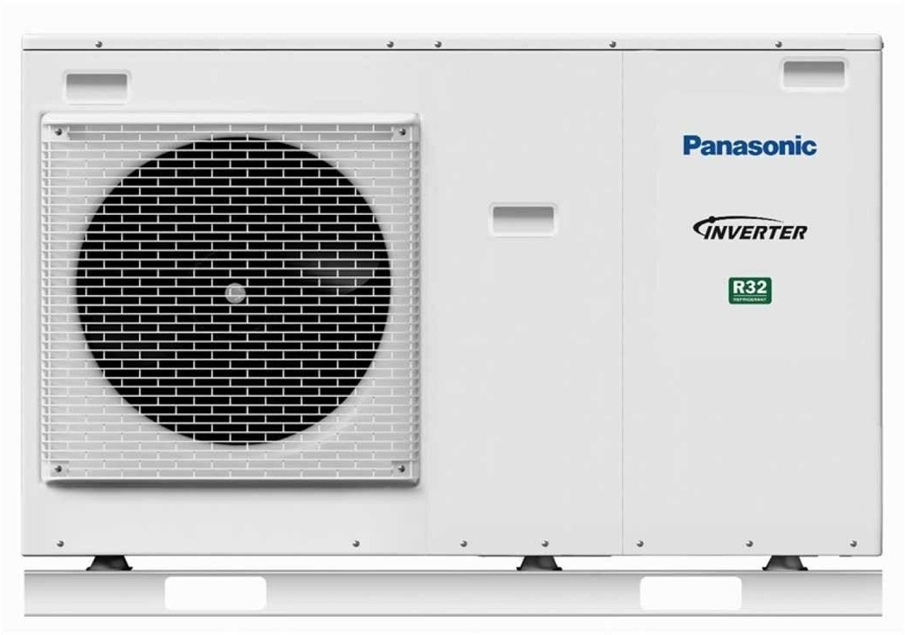

# Planung

* Rohrsysteme: 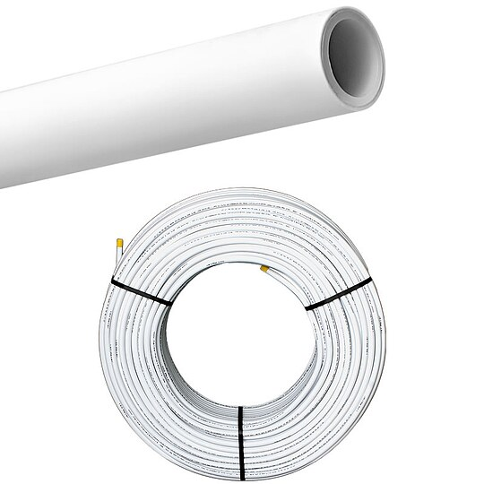
* Fittinge: 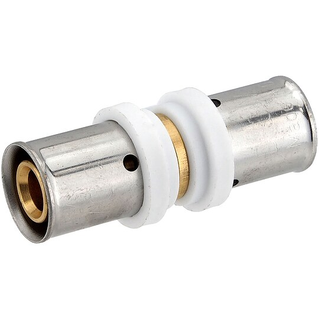
* Hydraulik Heizung: 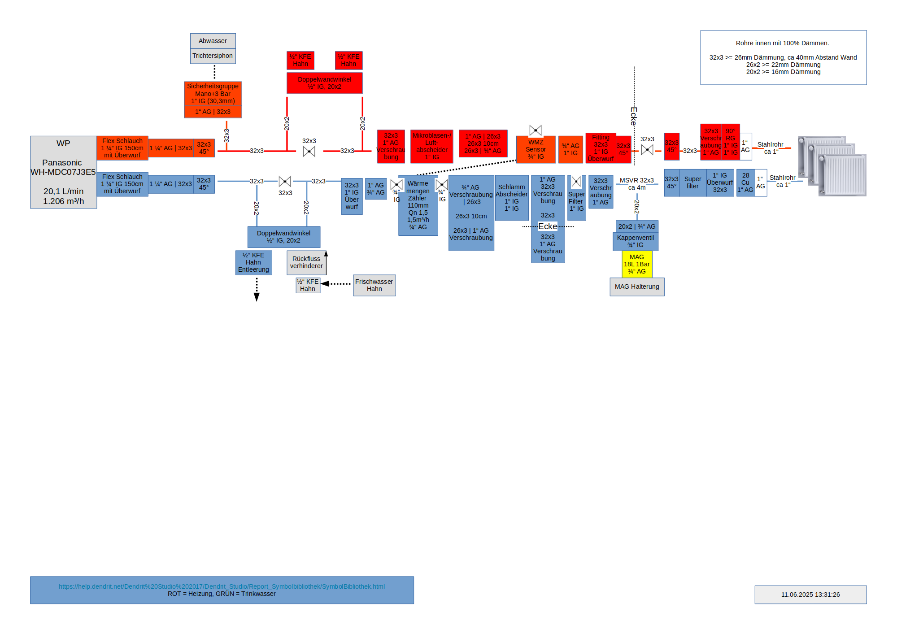
* Heizungsraum mit Gasheizung rechts: 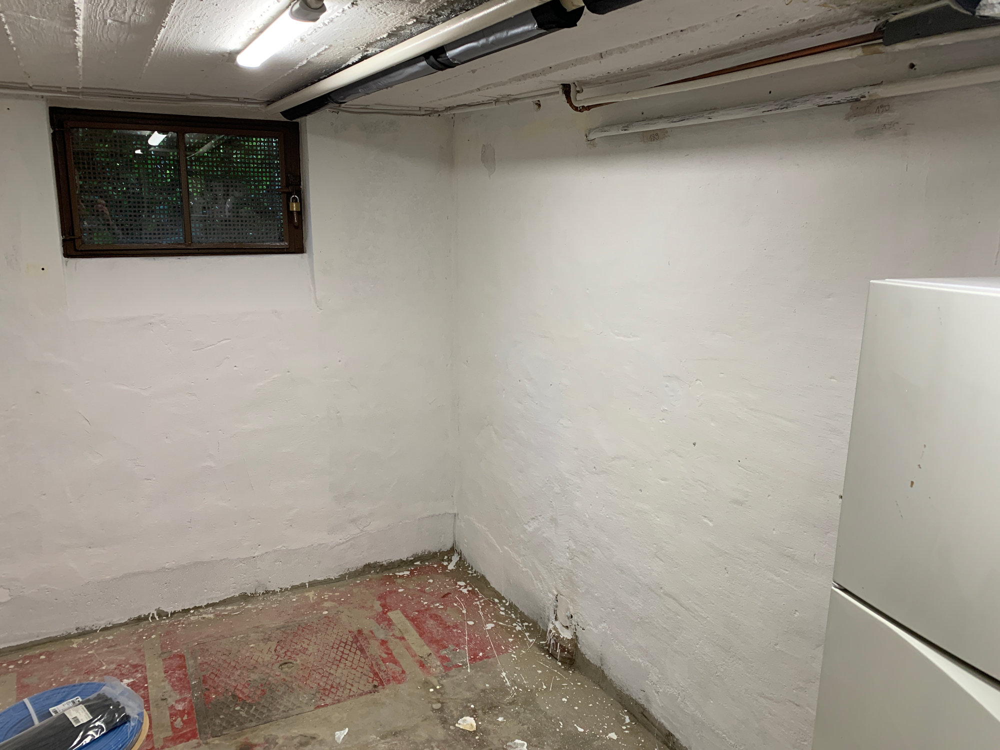

# Material und Werkzeug Fundament

* Blockstufen
* Mörtel
* Bohrkrone für Wanddurchbruch
* Kies für Sickergrube

# Material und Werkzeug Sanitärinstallation

* Presszange
* Sanitärzangen
* Rohr
* Fittinge
* Verschraubungen

# Material und Werkzeug Elektroinstallation

* 5x2,5mm² ca 15m
* FI 30mA plus 2 Sicherungen
* Shelly PRO 3EM zum Messen
* WLAN für Heishamon

# Hausautomatisierung & Monitoring

* [Heishamon Platine](https://www.tindie.com/products/thehognl/heishamon-communication-pcb/)
* 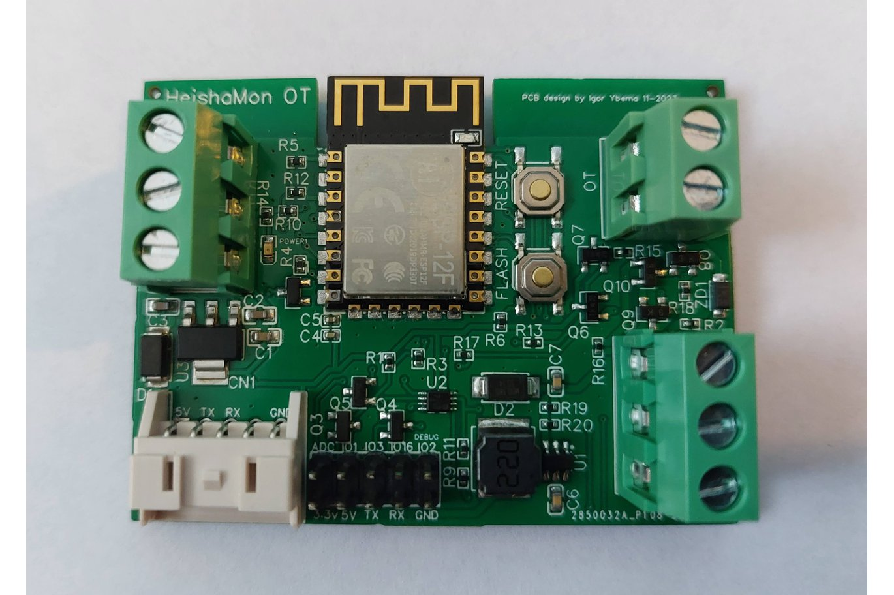
* MQTT Server
* Grafana
* ESPhome

# Aufbau

* Armaturen
* 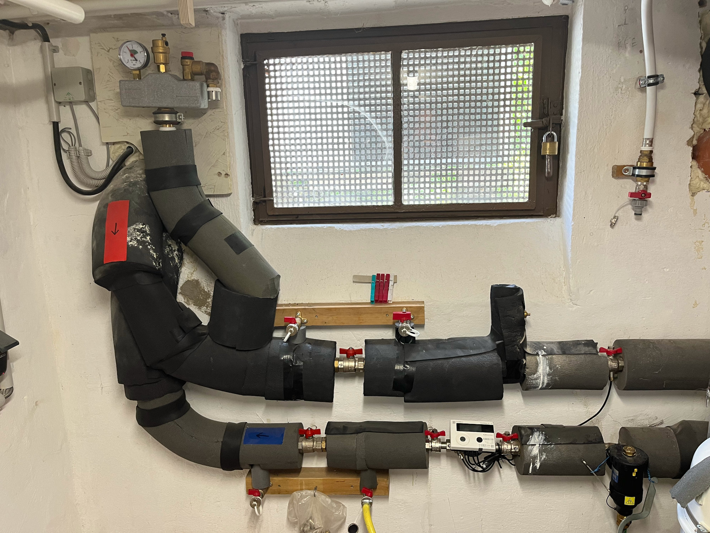
* Zeitlicher Aufwand Warmwasser (neben der Arbeit)
    * ~ 1 Woche Planung
    * ~ 1 Woche Warmwasserspeicher
* Zeitlicher Aufwand Heizung (neben der Arbeit)
    * ~ 4 Wochen Planung
    * ~ 1 Woche Fundament
    * ~ 1 Woche Armaturen
    * ~ 1 Woche Verrohrung
    * Danach: Tests, Optimierung

# Kosten

* Installationsmaterial und Werkzeug: ~1.500 € (davon 900 € für die Presszange)
* Kosten Heizung: 3.800 €
* Kosten Warmwasser: 2.300 €

# Ergebnisse

* Daten aus Grafana
* 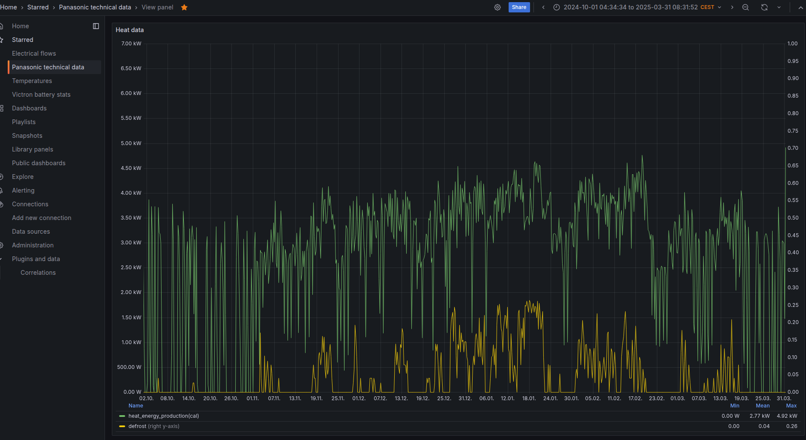
* 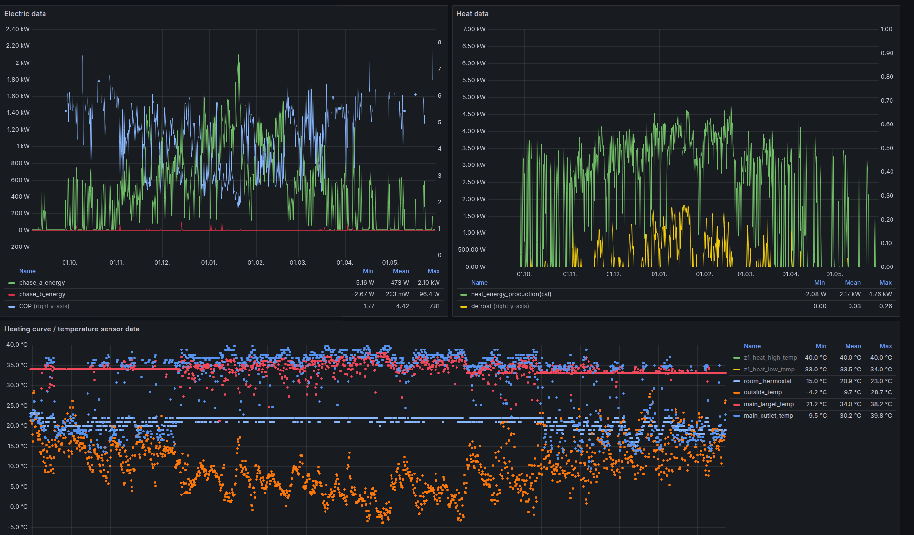
* Raumtemperatur: 21-22°C
* 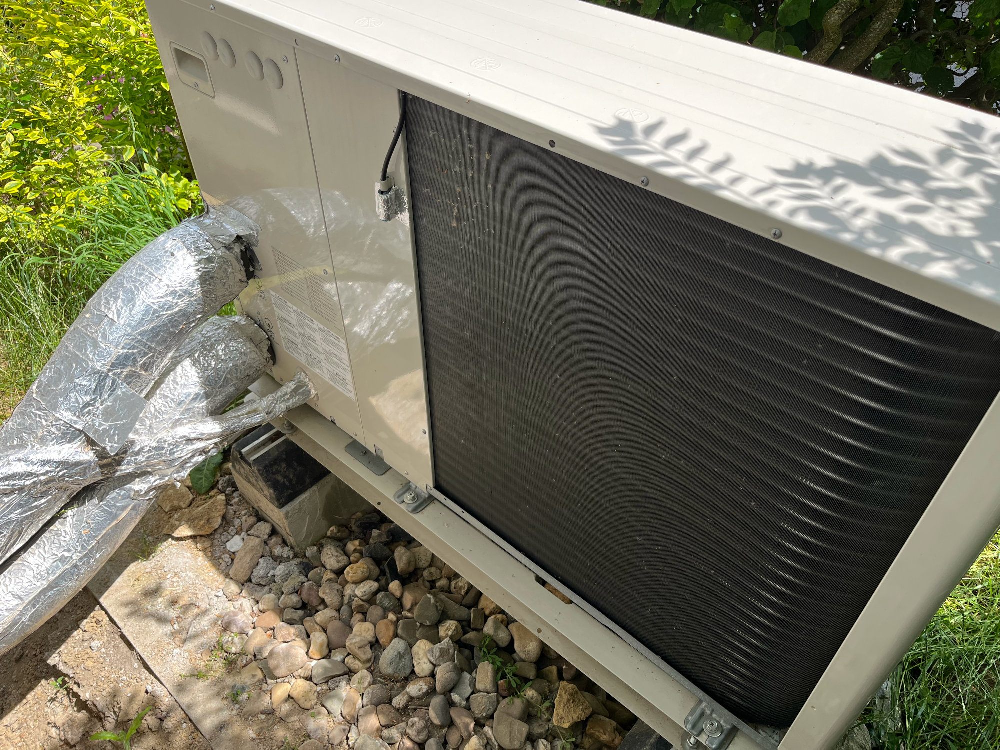
* 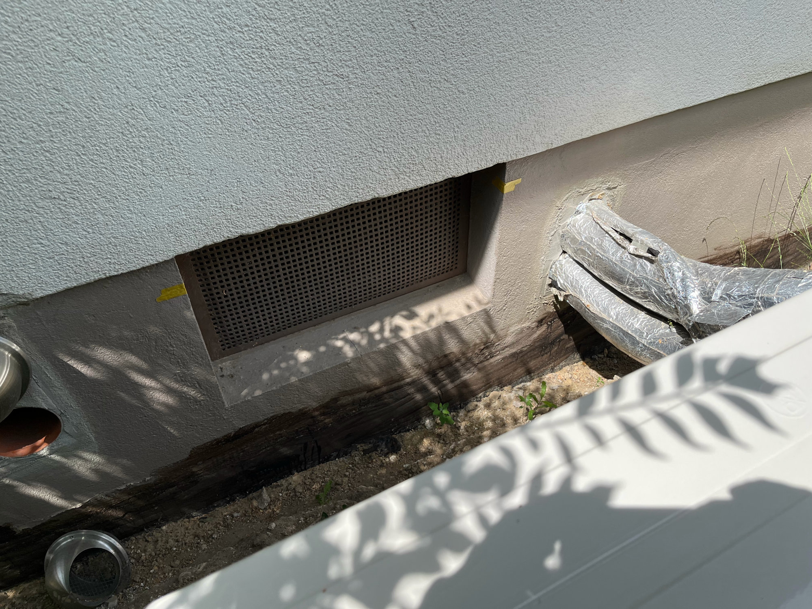
* 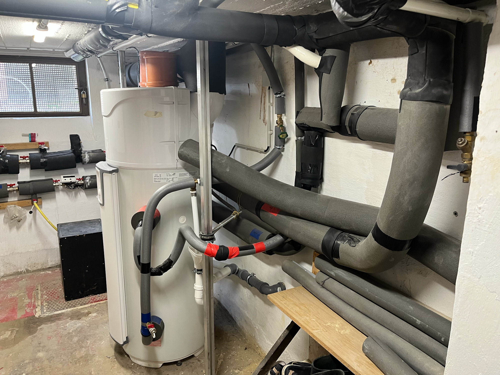
* 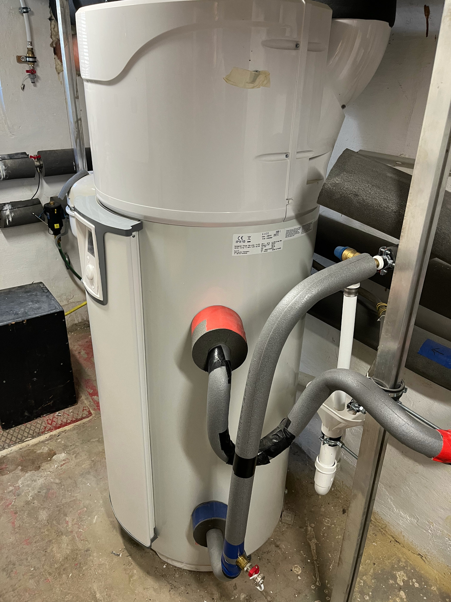

## Heizung

* 3.200 kWh Strom pro Jahr Heizung (davon ca. 20% aus PV Erzeugung)
* COP Heizung: ca. 4,5

## Warmwasser

* 350 kWh Strom pro Jahr Warmwasser (davon ca. 80% aus PV Erzeugung)
* COP Warmwasser: ca. 3,2

# Optimierungen & Learnings

* Fast alle Heizkörperventile abgebaut
* Vorlauftemperatur auf 33°C @ 10°C und 40°C @ -10°C
* Verbrauchsoptimierung durch Abschaltung bei stabiler Außen- und Innentemperatur (z.B. 2h mittags, 3h nachts)

# Wartung

* Filter reinigen
* Außengerät reinigen
* Ab und zu ins Monitoring schauen

# Dos und Dont's

* (-) Überdimensionierung
* (-) Geringe Rohrdurchmesser
* (o) Klemmringverschraubungen
* (+) Planung im Winter/Frühling
* (+) Ausführung Ende Heizsaison
* (+) Warmwasser zuerst

# Häufige Fragen

* Ist ein Hybridsystem sinnvoll?
* Wie funktioniert der Rückbau der Gasheizung?
* Was passiert beim Abtauen?
* Wie schlimm ist Takten?
* Ist eine Kombi aus Trinkwasser und Heizung mit einer Wärmepumpe sinnvoll?
* BAFA-Förderung nur mit Fachunternehmererklärung

# Informationsquellen

* youtube sonnenperle
* haustechnikdialog
* panasonic aquarea wiki
* pipetec dokumentation

# Fragerunde
